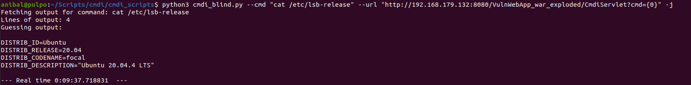

# cmdi_scripts
Scripts used for exploit command injection vulnerabilities

## cmdi_blind.py
Script created for exploit blind command injection issues and it can be used when a reverse shell is not possible due to firewall or network restrictions in the target or the target environment. The script uses awk, wc and sleep for signal ourselves. Additionally, uses a Java encoding 'trick' for Java targets using Runtime.getRuntime().exec().

Note: This script was build for Python3.

### Contraints
- You need a reasonable length for the injected parameter
- Requires the following metachars: ; | ' “ ( ) { } , $ % =
- It's not terribly fast. Of course it depends on the output length.
- If the result of the command changes during your attack, your output will be weird.

### Usage

```
$> python3 cmdi_blind.py -h
usage: cmdi_blind.py [-h] --cmd CMD --url URL [-v] [-o OUTPUT] [-j]

Script to exploit a blind command injection

optional arguments:
  -h, --help            show this help message and exit
  --cmd CMD             Command to inject.
  --url URL             URL of the target along with the vulnerable path.
  -v, --verbosity
  -o OUTPUT, --output OUTPUT
                        File to save the output.
  -j, --java            Encoding the payload for Java based targets. Note that Runtime.getRuntime().exec() does not support shell metacharacters.
```

### Sample

